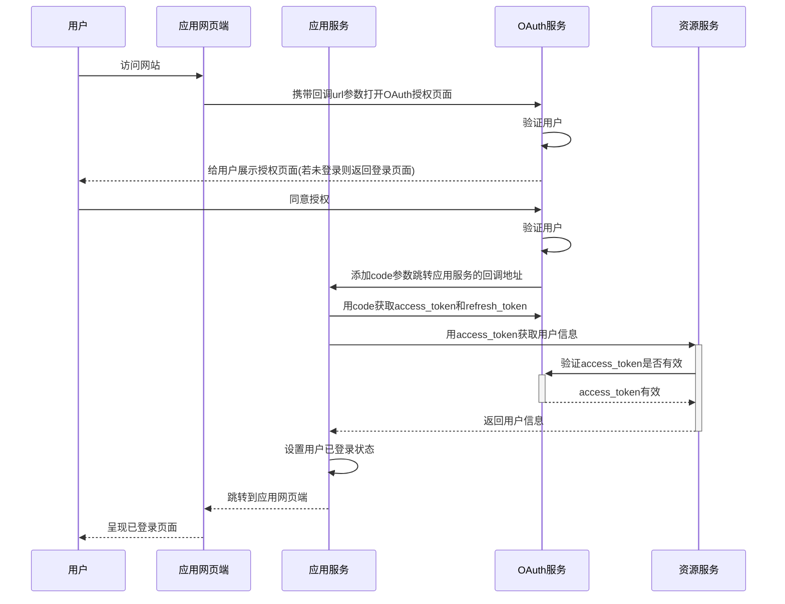

```
@EnableConfigurationProperties

```


Spring注解@Component、@Repository、@Service、@Controller区别

1. `@Service` 用于标注业务层组件
2. `@Controller` 用于标注控制层组件（如struts中的action）
3. `@Repository` 用于标注数据访问组件，即DAO组件
4. `@Component` 泛指组件，当组件不好归类的时候，我们可以使用这个注解进行标


http://localhost:8080/oauth/authorize?client_id=c1&client_secret=secret&response_type=code

http://localhost:8080/oauth/token?client_id=c1&client_secret=secret&grant_type=authorization_code&code=688aQr

http://localhost:8080/oauth/check_token?token=bcadb979-9849-4d28-b3ae-7c9449b2fc23

### OAuth2.0 流程




