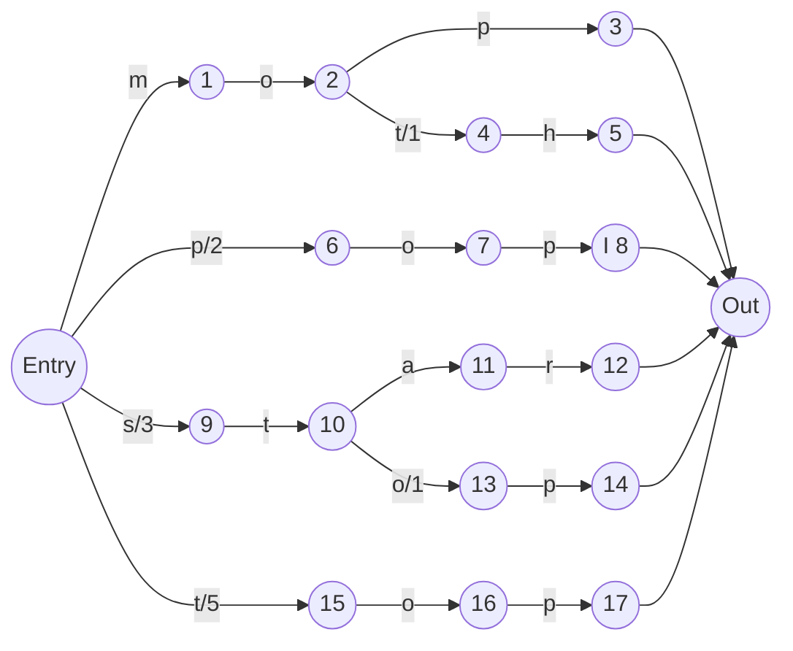

#### FST算法

```
# key: value, key从小到大排序
mop: 0
moth: 1
pop: 2
star: 3
stop: 4
top: 5
```


```mermaid
graph LR
ENTRY((Entry))-->|m|1((1))-->|o|2((2))-->|p|3((3))-->OUT((Out))
2-->|t/1|4((4))-->|h|5((5))-->OUT
ENTRY-->|p/2|6((6))-->|o|7((7))-->|p|8((I 8))-->OUT
ENTRY-->|s/3|9((9))-->|t|10((10))-->|a|11((11))-->|r|12((12))-->OUT
10-->|o/1|13((13))-->|p|14((14))-->OUT
ENTRY-->|t/5|15((15))-->|o|16((16))-->|p|17((17))-->OUT

```

